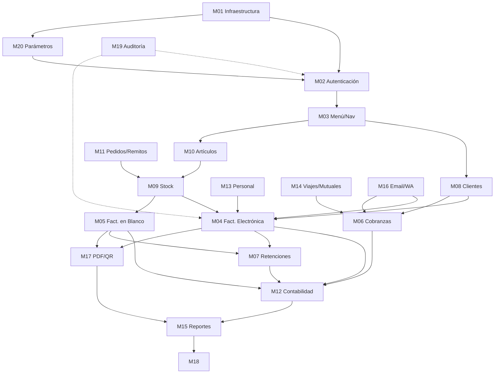

# AUDITORÍA TÉCNICA Y PLAN DE MIGRACIÓN — SISTEMA NEWGEST VFP 9 → .NET

---

## RESUMEN EJECUTIVO

**Sistema:** NEWGEST — Sistema de Gestión Administrativo-Contable
**Plataforma actual:** Visual FoxPro 9.0 (file-server, arquitectura de red compartida)
**Alcance:** ERP completo para empresas argentinas con facturación electrónica AFIP
**Tamaño:** 3.261 archivos · 2,7 GB · ~19 MB de ejecutable compilado
**Complejidad global:** **ALTA** — sistema maduro, con integración fiscal, multi-empresa, 415 reportes y 463 formularios

### Por qué migrar ahora

| Riesgo actual | Impacto |
|---|---|
| VFP 9.0 sin soporte desde 2015 | Sin parches de seguridad |
| Arquitectura file-server (DBF en red) | Corrupción de datos ante cortes de red |
| Single-threaded, 32 bits | No escala; incompatible con Windows 11 ARM |
| Cifrado de contraseñas casero (XOR simple) | Violación regulatoria posible |
| Sin backup transaccional | Pérdida de datos ante fallo |
| Dependencias OCX/DLL legacy (VFP6R, ANIGIF) | Incompatibles con OS modernos |

**Recomendación:** Migración por fases en 24–36 meses, comenzando por la capa de datos hacia SQL Server, luego reescritura modular en ASP.NET Core + Blazor/MAUI, manteniendo coexistencia temporal mediante APIs de transición.

---

## FASE 1 — INVENTARIO Y AUDITORÍA DEL SISTEMA

### 1.1 Mapa de Módulos Identificados

| # | Módulo | Archivos principales | LOC estimado | Complejidad |
|---|---|---|---|---|
| M01 | Arranque / Infraestructura | ARRANQUE.PRG, FUNCION.PRG, ACTIVWIN.PRG | ~2.500 | Medio |
| M02 | Autenticación y Seguridad | LOGON.SCX, ADMIN_USUARIOS.SCX, MAESTRO_PERMISOS.SCX | ~3.000 | Alto |
| M03 | Menú y Navegación | MENU.SCX, MENU2.SCX, ENTRADA.SCX, PRESENTA.SCX | ~4.000 | Medio |
| M04 | Facturación Electrónica (AFIP) | FACELEC1/2.SCX, FACELEC1_QR.SCX, *_LOTE.SCX | ~12.000 | **Crítico** |
| M05 | Facturación en Blanco | FACBLAN1/2.SCX, *_LOTE.SCX | ~8.000 | Alto |
| M06 | Cobranzas y Pagos | RECIBOCOBRO.SCX, RECBLAN1.SCX | ~6.000 | Alto |
| M07 | Retenciones (IIBB / IVA) | RETENCION_IIBB.SCX, RETENCION_IVA.SCX | ~4.000 | Alto |
| M08 | Gestión de Clientes | CONSULTE.SCX, EDO_CTA*.SCX, ANULACIONCTE.SCX | ~5.000 | Medio |
| M09 | Stock e Inventario | MOVIMIENTOS_STOCK.SCX, MOVIMIENTOS_SERIE.SCX | ~7.000 | Alto |
| M10 | Artículos y Catálogo | CONSULA.SCX, AGRUPACION_ARTICULOS.SCX | ~4.000 | Medio |
| M11 | Pedidos y Remitos | (forms de pedidos) | ~5.000 | Medio |
| M12 | Contabilidad / Libro Mayor | ASIENTOS, PLANCTA, EDO_ANALITICO*.SCX | ~6.000 | **Crítico** |
| M13 | Gestión de Personal | PERSONAL.DBF, HISPER | ~3.000 | Medio |
| M14 | Viajes y Mutuales | VIAJES.SCX, MUTUALES | ~4.000 | Medio |
| M15 | Reportes e Informes | 415 archivos .FRX + EXPORTXLS.SCX + EXPORDOC.SCX | ~15.000 | **Crítico** |
| M16 | Comunicaciones (Email/WhatsApp) | correo1.prg, whatsapp.prg, ENVIAR_CORREO.SCX | ~2.000 | Medio |
| M17 | Generación PDF / QR / Certificados | foxbarcodeqr.prg, generar_certificado.prg, gswin32 | ~3.000 | Alto |
| M18 | Exportaciones (Excel/Word) | EXPORTXLS.SCX, EXPORDOC.SCX, expor1doc.prg | ~3.500 | Medio |
| M19 | Auditoría del sistema | FUNCTION Auditor() en FUNCION.PRG, tabla AUDITORIA | ~500 | Bajo |
| M20 | Parámetros generales | PARAMGEN, Parametr.DBF, Terminal.DBF | ~2.000 | Medio |

**Total estimado de líneas de código activas:** ~100.000–120.000 LOC

---

### 1.2 Análisis Funcional por Módulo Crítico

#### M04 — Facturación Electrónica (CRÍTICO)

**Funcionalidades:**
- Emisión de facturas A/B/C/E con CAE (Código de Autorización Electrónico AFIP)
- Comunicación con el servicio web de AFIP (`CAEFoxNewgest` — proceso externo)
- Facturación en lote (FACELEC1_LOTE, FACELEC2_LOTE)
- Generación de PDF con código QR para trazabilidad
- Manejo de series de comprobantes (directorio `SeriesEM000001\`)

**Reglas de negocio embebidas:**
- Validación CUIT (algoritmo módulo 11, implementado en `FUNCTION Cuit()` en FUNCION.PRG:595–623)
- Validación CUIL (`FUNCTION cuil()` en FUNCION.PRG:625–664)
- Cálculo de IVA inscripto/no inscripto, exento
- Gestión de tipos de comprobante (FacturaA/B/C, NotaCreA/B/C, NotaDebA/B/C, Remito)
- Numeración consecutiva controlada por tabla `IDCTRLTRAN` (función `Consecutivo()` en FUNCION.PRG:949–1078)
- Certificados digitales PKCS#12 (.p12) para firma digital AFIP

**Dependencias externas críticas:**
- `CAEFoxNewgest` — servicio/proceso separado para comunicación con AFIP (parámetro `V_Dircomunicacion`)
- Ghostscript (`gswin32.exe`, `gsdll32.dll`) para generación PDF
- OpenSSL (`openssl.exe`, `libssl-1_1-x64.dll`) para firma de mensajes
- Librería HPDF (`libhpdf.dll`) para PDF nativo

#### M12 — Contabilidad (CRÍTICO)

**Tablas involucradas:** `ASIENTOS`, `PLANCTA`, `LIBROIVA`, `IMPUTADO`, `SALDOCTA`, `HISIVA`

**Funcionalidades:**
- Plan de cuentas jerárquico (tabla `PLANCTA`)
- Asientos contables automáticos y manuales
- Libro de IVA Ventas / Compras
- Imputación de comprobantes a cuentas
- Cálculo de saldos de cuenta corriente (tabla `SALDOCTA`)
- Estado de cuenta cliente (múltiples variantes: `EDO_CTA_FINAL`, `EDO_CTA_SINSALTO`, `EDO_ANALITICO_*`)

#### M15 — Reportes (CRÍTICO)

- **415 reportes .FRX** definidos en formato binario propietario de VFP
- Previsualizador: `FoxyPreviewer.app` (librería open-source VFP)
- Exportación directa a XLS via `COPY TO TYPE XLS` y COM Excel
- Exportación a Word via COM
- Generación de PDFs via Ghostscript + PostScript

---

### 1.3 Hallazgos Técnicos Destacados

#### Seguridad — VULNERABILIDADES IDENTIFICADAS

```vfp
* FUNCION.PRG:267-288 — Cifrado casero (reversible, no es hash)
FUNCTION Desencry / FUNCTION Encrypt
* Algoritmo: inversión de string + desplazamiento ASCII
* RIESGO: Contraseñas recuperables si se accede al archivo USUARIOS.DBF
```

```vfp
* FUNCION.PRG:735-756 — PROCEDURE CLAVES
* Validación de permisos por SEEK en tabla DBF en red
* Vulnerable a race condition y manipulación directa del archivo
```

#### Gestión de Concurrencia — PATRÓN PROBLEMÁTICO

```vfp
* FUNCION.PRG:498-518 — FUNCTION APPBLAN2
* Retry loop de FLOCK() hasta 30 intentos sin backoff exponencial
* En red con alta carga → deadlocks y datos perdidos silenciosamente
```

#### Números de Secuencia — RACE CONDITION

```vfp
* FUNCION.PRG:949-1078 — FUNCTION Consecutivo()
* Usa tabla IDCTRLTRAN con RLOCK() para IDs únicos
* Si el lock falla, el número no se incrementa → duplicados posibles
```

#### Variables Globales Masivas

```vfp
* ARRANQUE.PRG:18-48 — 40+ variables PUBLIC
* Estado de aplicación completamente global
* Imposible testear unitariamente sin arrancar la app completa
```

#### Modo Demo Destructivo

```vfp
* ARRANQUE.PRG:162-163
ERASE 'Parametr.dbf'  && Borra tabla de configuración si vence la demo
ERASE 'Parametr.cdx'
* RIESGO: Pérdida de configuración en producción si fecha sistema cambia
```

---

## FASE 2 — ANÁLISIS DE LA BASE DE DATOS

### 2.1 Inventario de Tablas (Empresa EM000001)

| Tabla | Propósito | Memo (.FPT) | Índices conocidos |
|---|---|---|---|
| `STOCK` | Catálogo de artículos, precios, existencias | Sí | Código, nombre, grupos |
| `CLIENTES` | Maestro de clientes | Sí | CUIT, código, nombre, zona |
| `EMICOMPR` | Comprobantes emitidos (facturas, NC, ND) | Sí | IdTran, fecha, cliente, tipo |
| `MOVSTOCK` | Movimientos de stock (entradas/salidas) | Sí | TransNum, fecha, artículo |
| `LIBROIVA` | Libro IVA ventas/compras | Sí | IdTran, período |
| `IMPUTADO` | Imputación de pagos a comprobantes | No | IdImputado, comprobante |
| `PAGOS` | Pagos recibidos | No | IdPagos, cliente, fecha |
| `MEDIOPAG` | Detalle de medios de pago (cheques, tarjetas) | Sí | IdMp |
| `PENDIENT` | Comprobantes pendientes de cobro | No | Cliente, vencimiento |
| `SALDOCTA` | Saldos de cuenta corriente | No | Cliente |
| `SALDOST` | Saldos de stock | No | Artículo |
| `ASIENTOS` | Asientos contables | No | IdAsiento, fecha |
| `PLANCTA` | Plan de cuentas contables | No | Cuenta, código |
| `PERSONAL` | Empleados/vendedores | Sí | Legajo, nombre |
| `AUDITORIA` | Log de auditoría del sistema | No | Usuario, fecha, módulo |
| `ARTEXIS` | Existencias por artículo/depósito | No | Artículo, depósito |
| `ARTGRUPOS` | Grupos de artículos | No | Código grupo |
| `COSTOART` | Costos históricos de artículos | No | Artículo, fecha |
| `DETATEMP` | Detalle temporal de comprobantes en proceso | No | IdTran |
| `IDCTRLTRAN` | Tabla de control de IDs/secuencias | No | — (1 sola fila) |
| `MUTUALES` | Entidades mutuales | No | Código |
| `VIAJES` | Gestión de viajes | No | IdViajes |
| `REMVIAJE` | Remitos de viaje | No | IdRem |
| `PEDIDOS` | Pedidos de mercadería | Sí | Número, fecha, cliente |
| `ZONACLIE` | Zonas geográficas de clientes | No | Código zona |
| `COMICLIE` | Comisiones por cliente | No | — |
| `COMIVEND` | Comisiones por vendedor | No | — |
| `HISCLI` | Historial de clientes | Sí | — |
| `HISEMICO` | Historial de comprobantes emitidos | No | — |
| `HISIVA` | Historial IVA | Sí | — |
| `HISMOVST` | Historial movimientos stock | Sí | — |
| `HISSTOCK` | Historial de stock | Sí | — |
| `HISPER` | Historial personal | Sí | — |
| `HISTORIC` | Histórico general | No | — |
| `TMPVTOLOT` | Temporal vencimientos en lote | No | IdTran |
| `PRETARJE` | Precios por tarjeta/plan | No | — |
| `RUBBLOCK` | Bloqueo por rubro | No | — |
| `PERRELOJ` | Control de reloj/tiempo | No | — |
| `Indices` | Índices de control | No | — |
| `CUENTAS` | Cuentas bancarias/caja | No | — |
| `UNIDADES` | Unidades de medida | No | — |
| `CLAVES` | Claves/contraseñas (sistema legacy) | Sí | — |

**Tablas globales (raíz `C:\newgest`):**
- `Parametr.DBF` — configuración multiempresa, parámetros del sistema
- `Terminal.DBF` — configuración por terminal de red
- `AGENDA.DBF` — agenda/calendario

### 2.2 Relaciones Implícitas Identificadas (por código)

```
CLIENTES ──────────── EMICOMPR       (por campo cliente/cuit)
EMICOMPR ──────────── LIBROIVA       (por IdTran)
EMICOMPR ──────────── IMPUTADO       (por IdTran/comprobante)
EMICOMPR ──────────── DETATEMP       (durante carga)
PAGOS ─────────────── IMPUTADO       (por IdPagos)
PAGOS ─────────────── MEDIOPAG       (por IdPagos → IdMp)
STOCK ─────────────── MOVSTOCK       (por código artículo)
MOVSTOCK ──────────── ARTEXIS        (actualización de existencias)
STOCK ─────────────── COSTOART       (historial costos)
STOCK ─────────────── ARTGRUPOS      (por grupo)
PERSONAL ──────────── EMICOMPR       (vendedor)
VIAJES ─────────────── REMVIAJE      (por IdViajes)
IDCTRLTRAN ─────────── todos         (secuenciador único)
```

### 2.3 Modelo Relacional Propuesto (SQL Server)

```sql
-- Schema principal
CREATE SCHEMA neg;   -- Negocio: artículos, clientes, proveedores
CREATE SCHEMA com;   -- Comercial: comprobantes, pagos
CREATE SCHEMA cnt;   -- Contabilidad: plan de cuentas, asientos
CREATE SCHEMA inv;   -- Inventario: stock, movimientos
CREATE SCHEMA cfg;   -- Configuración: parámetros, terminales
CREATE SCHEMA aud;   -- Auditoría: logs

-- Tabla maestra de empresas (reemplaza directorios EM######)
CREATE TABLE cfg.Empresas (
    IdEmpresa       INT IDENTITY PRIMARY KEY,
    Codigo          CHAR(6) NOT NULL UNIQUE,  -- '000001'
    RazonSocial     NVARCHAR(100) NOT NULL,
    CUIT            CHAR(13) NOT NULL,
    CondicionIVA    TINYINT NOT NULL,
    -- ...
);

-- Mapeo de tipos problemáticos VFP → SQL Server
-- C(n) → NVARCHAR(n) o CHAR(n)
-- N(x,y) → DECIMAL(x,y) o NUMERIC(x,y)
-- D    → DATE
-- L    → BIT
-- M    → NVARCHAR(MAX)
-- G    → VARBINARY(MAX)  [campos OLE/binarios]
-- T    → DATETIME2
-- I    → INT
```

**Conflictos de tipos a resolver:**

| Tipo VFP | Descripción | SQL Server | Acción |
|---|---|---|---|
| `M` (Memo) | Texto largo en .FPT | `NVARCHAR(MAX)` | Migrar con conversión de cp1252→UTF-16 |
| `G` (General/OLE) | Objetos embebidos | `VARBINARY(MAX)` | Evaluar si hay datos reales; probablemente vacío |
| Fechas `CTOD('  /  /    ')` | Fecha vacía VFP | `NULL` | Mapear espacio-fecha → NULL |
| Campos C con SPACE(n) | "vacío" como espacios | `NVARCHAR` con TRIM | Normalizar en ETL |
| Índices CDX multi-tag | Un CDX = múltiples índices | Índices SQL separados | Recrear según uso real |
| `IDCTRLTRAN` (1 fila) | Secuenciador | `SEQUENCE` o `IDENTITY` | Reemplazar por SEQUENCE por tabla |

---

## FASE 3 — PLAN DE MIGRACIÓN MÓDULO A MÓDULO

### 3.1 Stack Tecnológico Recomendado

```
┌─────────────────────────────────────────────────────────┐
│  FRONTEND                                               │
│  • Desktop: .NET 8 MAUI o WPF (usuarios de escritorio) │
│  • Web admin: ASP.NET Core 8 + Blazor Server           │
│  • Móvil futuro: MAUI (reutiliza lógica)               │
├─────────────────────────────────────────────────────────┤
│  API                                                    │
│  • ASP.NET Core 8 Web API (REST + minimal APIs)        │
│  • Patrón: CQRS + MediatR + Repository                 │
│  • Autenticación: ASP.NET Identity + JWT               │
├─────────────────────────────────────────────────────────┤
│  CAPA DE DATOS                                          │
│  • ORM Principal: EF Core 8 (queries complejos)        │
│  • Micro-ORM: Dapper (reportes y consultas pesadas)    │
│  • Base de datos: SQL Server 2019+                     │
├─────────────────────────────────────────────────────────┤
│  INFRAESTRUCTURA                                        │
│  • On-premise inicial (misma red, sin cambio de UX)    │
│  • Contenedores Docker para servicios (AFIP, PDF)      │
│  • Azure migrate opcional en Fase 3                    │
└─────────────────────────────────────────────────────────┘
```

**Justificación de elecciones:**
- **MAUI/WPF vs Blazor**: dado que los usuarios actuales trabajan en desktop, WPF + Blazor híbrido permite reuso de controles. MAUI permite futuro mobile.
- **EF Core + Dapper**: EF Core para ABM transaccionales; Dapper para las 415 consultas de reportes que requieren SQL nativo optimizado.
- **CQRS**: la clara separación entre lecturas (reportes, consultas) y escrituras (facturación, pagos) hace que CQRS sea natural y no prematuro aquí.

### 3.2 Roadmap por Módulo

#### SPRINT 0 (Semanas 1–4): Fundación de datos

**Objetivo:** SQL Server operativo con datos migrados, VFP sigue siendo el sistema productivo

```
[S0-1] Setup SQL Server + schemas
[S0-2] Script ETL: DBF → SQL Server (Python + dbfread, ya existe base en webapp_stock)
[S0-3] Validación de integridad referencial post-migración
[S0-4] Triggers de auditoría en SQL Server (reemplaza tabla AUDITORIA DBF)
[S0-5] Script de sincronización VFP↔SQL para coexistencia
```

#### SPRINT 1–2 (Semanas 5–12): Autenticación y Seguridad

**Módulo M02 — Riesgo: ALTO**

```csharp
// Reemplaza: cifrado Encrypt/Desencry de FUNCION.PRG
// Por: ASP.NET Core Identity con BCrypt
services.AddIdentity<ApplicationUser, ApplicationRole>()
    .AddEntityFrameworkStores<NewgestDbContext>()
    .AddDefaultTokenProviders();

// Migración de contraseñas: forzar reset en primer login
// Las contraseñas VFP NO pueden migrarse (cifrado reversible → no es hash)
```

- Crear `ApplicationUser` con campos de VFP: Legajo, Nombre, Empresa, Terminal
- Replicar tabla de permisos por módulo/opción
- Eliminar acceso directo a DBF de contraseñas

#### SPRINT 3–4 (Semanas 13–20): Catálogo y Maestros

**Módulos M08, M10 — Riesgo: BAJO-MEDIO**

- Clientes, Artículos, Grupos, Zonas, Unidades
- ABM completo con validación CUIT/CUIL (algoritmo ya probado, migrar a C#)
- API REST + pantalla Blazor

#### SPRINT 5–7 (Semanas 21–32): Inventario y Stock

**Módulo M09 — Riesgo: MEDIO**

- Movimientos de entrada/salida con actualización de `SALDOST` / `ARTEXIS`
- Mantener trazabilidad de lotes/series
- Reemplazar la lógica de `FUNCTION CANTIDADES()` (FUNCION.PRG:431–472) por cálculo en BD

#### SPRINT 8–11 (Semanas 33–48): Facturación (módulo más crítico)

**Módulos M04, M05 — Riesgo: CRÍTICO**

```
Estrategia: Wrapping del proceso CAEFoxNewgest existente como microservicio
hasta tener implementación nativa .NET del WS AFIP
```

```csharp
// Servicio AFIP — interfaz que permite swap
public interface IAfipService {
    Task<CaeResponse> SolicitarCae(ComprobanteRequest request);
    Task<bool> ValidarComprobante(string cuit, TipoComprobante tipo, long numero);
}

// Implementación temporal: wrapper del ejecutable VFP existente
public class AfipServiceVfpWrapper : IAfipService { ... }

// Implementación final: SDK .NET de AFIP WS
public class AfipServiceWsfe : IAfipService { ... }
```

**Secuenciador de comprobantes** — reemplazar `IDCTRLTRAN`:

```sql
CREATE SEQUENCE com.SeqEmicompr START WITH 1 INCREMENT BY 1;
-- En SP de emisión de comprobante, usar NEXT VALUE FOR com.SeqEmicompr
-- dentro de transacción → atomicidad garantizada sin RLOCK loops
```

#### SPRINT 12–15 (Semanas 49–64): Cobranzas y Contabilidad

**Módulos M06, M07, M12 — Riesgo: ALTO-CRÍTICO**

- Imputación de pagos a comprobantes: lógica compleja de matching
- Retenciones IIBB/IVA: reglas provinciales (requiere estudio profundo del código fuente de los forms)
- Plan de cuentas + asientos contables: reemplazar por estructura de doble partida en SQL

#### SPRINT 16–18 (Semanas 65–76): Reportes

**Módulo M15 — Riesgo: CRÍTICO (por volumen)**

```
415 FRX → no se migran directamente (formato binario propietario)
Estrategia:
  1. Clasificar 415 reportes en ~40 familias únicas (muchos son variaciones)
  2. Reescribir las ~40 plantillas base en RDLC (SQL Server Reporting Services)
     o FastReport .NET
  3. Las variaciones se generan por parámetros, no por archivos separados
  4. Exports: usar ClosedXML (Excel), DocumentFormat.OpenXml (Word), QuestPDF (PDF)
```

#### SPRINT 19–20 (Semanas 77–84): Integraciones

**Módulos M16, M17, M18 — Riesgo: MEDIO**

- Email: reemplazar `CsFoxySmtp.dll` por `MailKit` (.NET)
- WhatsApp: evaluar Twilio WhatsApp API o API oficial Meta
- QR: `QRCoder` (NuGet, sin dependencias nativas)
- PDF: `QuestPDF` o `iTextSharp` (reemplaza Ghostscript)
- Excel: `ClosedXML` (reemplaza COM Excel)

---

### 3.3 Estrategia de Coexistencia VFP + .NET

```
Fase A (Sprints 0-4):   Solo datos en SQL Server. VFP lee/escribe DBF y SQL en paralelo.
Fase B (Sprints 5-11):  Módulos de maestros y stock en .NET. VFP consume datos SQL.
Fase C (Sprints 12-15): Facturación y cobranzas migradas. VFP solo para reportes legacy.
Fase D (Sprints 16-20): Reportes migrados. VFP desactivado.
```

**Mecanismo de sincronización temporal (Fase A-B):**

```python
# Extender el ETL existente en webapp_stock (ya hay base en C:\newgest\webapp_stock\)
# Agregar sync bidireccional con timestamps:
# - VFP escribe → trigger DBF-level watch → INSERT/UPDATE en SQL Server
# - .NET escribe SQL → scheduled job exporta a DBF para VFP
# Riesgo: window de inconsistencia de ~30 seg. Aceptable para maestros, NO para comprobantes.
```

---

## FASE 4 — CONSIDERACIONES TRANSVERSALES

### 4.1 Autenticación y Seguridad

| Aspecto | VFP actual | Propuesta .NET |
|---|---|---|
| Hash de contraseñas | XOR reversible (INSEGURO) | BCrypt vía ASP.NET Identity |
| Sesión | Variable global `X_Usuario` | JWT + Refresh Token |
| Permisos | Tabla `Permisos.DBF` + SEEK | Claims/Roles en Identity + PolicyBased Auth |
| Multi-empresa | Variable global `V_EMPRESA` | Tenant ID en JWT Claims |
| Auditoría | Tabla `AUDITORIA.DBF` con FLOCK | SQL Server + triggers + tablas de auditoría |
| Transport | Red LAN, sin TLS | HTTPS obligatorio con TLS 1.3 |

**Acción inmediata (antes de migrar):** Forzar cambio de contraseñas a todos los usuarios al momento del corte, ya que las contraseñas VFP no pueden migrarse de forma segura.

### 4.2 Reportes — Estrategia de Migración

```
415 FRX → Clasificación propuesta:

Familia              | Cantidad aprox | Motor sugerido
─────────────────────┼────────────────┼────────────────────────
Comprobantes (FC/NC) | ~30            | QuestPDF (PDF directo)
Estados de cuenta    | ~25            | RDLC o FastReport
Estadísticas ventas  | ~40            | Power BI Embedded o RDLC
Movimientos stock    | ~35            | Dapper + RDLC
Informes contables   | ~20            | RDLC
Listados maestros    | ~50            | ClosedXML (directo a XLS)
Retenciones/IVA      | ~15            | RDLC (regulatorio, precisión crítica)
Mutuales/Viajes      | ~20            | RDLC
Comprobantes lote    | ~25            | QuestPDF batch
Utilitarios varios   | ~155           | Evaluar caso a caso
```

**Recomendación:** FastReport .NET ofrece un importador parcial de FRX que puede acelerar ~20% de la migración de reportes simples.

### 4.3 Integraciones Externas

| Integración | Estado actual | Propuesta .NET |
|---|---|---|
| AFIP WS (CAE) | `CAEFoxNewgest.exe` externo + SSL/OpenSSL | SDK C# para AFIP WSFE/WSFEX o NuGet `AfipDev` |
| Impresoras fiscales | Via `SET PRINTER` VFP | `System.Drawing.Printing` + drivers fabricante |
| Email SMTP | `CsFoxySmtp.dll` custom | `MailKit` (RFC compliant) |
| WhatsApp | `whatsapp.prg` (probablemente API no oficial) | Twilio / Meta Cloud API |
| Excel | COM Automation (`CreateObject("Excel.Application")`) | `ClosedXML` (sin Office requerido) |
| Word | COM Automation | `DocumentFormat.OpenXml` |
| PDF | Ghostscript + PostScript | `QuestPDF` o `iTextSharp` |
| Códigos QR | `FoxBarcodeQR.pjx` (librería VFP) | `QRCoder` (NuGet) |
| Certificados AFIP | `.p12` manual en directorio | Azure Key Vault o Windows Certificate Store |
| Lector código barras | Via puertos COM (PUERTO1/2/3) | `System.IO.Ports` o USB HID |

### 4.4 Testing

```
Estrategia de pruebas en 3 niveles:

NIVEL 1 — Unitario (nuevo código .NET)
  • xUnit + FluentAssertions
  • Mockear IAfipService, IEmailService
  • Cobertura mínima: 80% lógica de negocio (CUIT, cálculos IVA, consecutivos)
  • Algoritmos críticos a testear unitariamente:
    - Validación CUIT/CUIL (FUNCION.PRG:595–664 → C# con 50+ casos de prueba)
    - Función Letter() (número a letras, FUNCION.PRG:329–417)
    - Cálculo de retenciones provinciales
    - Imputación de pagos

NIVEL 2 — Integración
  • Base de datos de test con datos anonimizados de producción
  • TestContainers (SQL Server en Docker para CI)
  • Tests de endpoints API con WebApplicationFactory

NIVEL 3 — UAT (User Acceptance Testing)
  • Plan de pruebas paralelo: ejecutar el mismo proceso en VFP y .NET
  • Comparar totales de facturación, libro IVA, saldos de cuenta corriente
  • Período mínimo de paralelo: 1 mes fiscal completo por módulo
  • Criterio de aceptación: diferencia cero en cierres contables
```

### 4.5 Infraestructura

```
ON-PREMISE (recomendado para inicio):
┌─────────────────────────────────────────────────────┐
│  Servidor existente (o nuevo)                       │
│  • Windows Server 2022                              │
│  • SQL Server 2022 (o Express para inicio)          │
│  • IIS para ASP.NET Core API                        │
│  • Servicio Windows para sincronización VFP↔SQL     │
└─────────────────────────────────────────────────────┘
  ↓ (Fase 3, opcional)
┌─────────────────────────────────────────────────────┐
│  Azure (migración gradual)                          │
│  • Azure SQL Database (Managed Instance)            │
│  • Azure App Service para API                       │
│  • Azure Key Vault para certificados AFIP           │
│  • Azure Blob Storage para PDFs/comprobantes        │
└─────────────────────────────────────────────────────┘
```

### 4.6 Capacitación y Adopción

| Grupo | Impacto | Acción |
|---|---|---|
| Usuarios operativos (facturación, cobranzas) | Alto | Capacitación 2 días + manual en video |
| Contadores | Medio | Validación paralela de reportes contables |
| Administradores IT | Alto | Capacitación SQL Server, IIS, backup |
| Dirección | Bajo | Demo de dashboards y mejoras |

**Plan de rollout:** módulo a módulo, jamás big-bang. Cada módulo tiene su go/no-go basado en los criterios de aceptación definidos.

---

## ENTREGABLE FINAL — DOCUMENTOS CONSOLIDADOS

### Tabla Resumen de Módulos

| Módulo | Complejidad | Esfuerzo (días-dev) | Riesgo | Prioridad migración |
|---|---|---|---|---|
| M01 Infraestructura | Medio | 10 | Bajo | Sprint 0 |
| M02 Autenticación | Alto | 25 | Alto | Sprint 1 |
| M03 Menú/Nav | Medio | 15 | Bajo | Sprint 2 |
| M04 Facturación electrónica | **Crítico** | **80** | **Crítico** | Sprint 8–11 |
| M05 Facturación en blanco | Alto | 40 | Alto | Sprint 8–11 |
| M06 Cobranzas | Alto | 35 | Alto | Sprint 12 |
| M07 Retenciones | Alto | 30 | Alto | Sprint 13 |
| M08 Gestión clientes | Medio | 20 | Medio | Sprint 3 |
| M09 Stock/Inventario | Alto | 40 | Medio | Sprint 5 |
| M10 Artículos | Medio | 15 | Bajo | Sprint 3 |
| M11 Pedidos/Remitos | Medio | 25 | Medio | Sprint 6 |
| M12 Contabilidad | **Crítico** | **60** | **Crítico** | Sprint 14 |
| M13 Personal | Medio | 20 | Bajo | Sprint 7 |
| M14 Viajes/Mutuales | Medio | 25 | Medio | Sprint 7 |
| M15 Reportes (415 FRX) | **Crítico** | **120** | **Crítico** | Sprint 16–18 |
| M16 Email/WhatsApp | Medio | 15 | Bajo | Sprint 19 |
| M17 PDF/QR/Cert | Alto | 20 | Medio | Sprint 17 |
| M18 Exportaciones | Medio | 15 | Bajo | Sprint 19 |
| M19 Auditoría | Bajo | 5 | Bajo | Sprint 0 |
| M20 Parámetros | Medio | 10 | Bajo | Sprint 1 |
| **TOTAL** | | **~625 días-dev** | | **~30 meses** |

*Asumiendo equipo de 3 desarrolladores .NET senior + 1 DBA + 1 QA*

---

### Diagrama de Dependencias (Mermaid)



---

### Cronograma de Migración por Fases

```
AÑO 1
Q1 │ Sprint 0:   SQL Server + ETL + Auditoría
   │ Sprint 1-2: Autenticación, Permisos, Parámetros
Q2 │ Sprint 3-4: Clientes, Artículos, Maestros
   │ Sprint 5:   Inventario/Stock parte 1
Q3 │ Sprint 6:   Pedidos/Remitos
   │ Sprint 7:   Personal, Viajes, Mutuales
Q4 │ Sprint 8-9: Facturación (análisis profundo + prototipo)
   │ Sprint 10-11: Facturación electrónica AFIP en producción

AÑO 2
Q1 │ Sprint 12: Cobranzas y Pagos
   │ Sprint 13: Retenciones IIBB/IVA
Q2 │ Sprint 14-15: Contabilidad + Plan de cuentas + Libro IVA
Q3 │ Sprint 16-17: Reportes (familias principales)
   │ Sprint 18: Reportes (familias secundarias)
Q4 │ Sprint 19-20: Email, PDF, QR, Exportaciones
   │ UAT final + go-live completo
   │ Desactivación VFP
```

---

### Riesgos y Plan de Mitigación

| # | Riesgo | Probabilidad | Impacto | Mitigación |
|---|---|---|---|---|
| R01 | Cambios en WS AFIP durante migración | Alta | Crítico | Mantener wrapper VFP como fallback hasta estabilizar |
| R02 | Datos corruptos en DBF no detectados hasta migración | Media | Alto | ETL con validación exhaustiva + reporte de anomalías antes de cut-over |
| R03 | Resistencia de usuarios al cambio de UI | Alta | Medio | UX similar al VFP, capacitación temprana, feedback continuo |
| R04 | Pérdida de lógica de negocio en 415 reportes .FRX | Alta | Alto | Documentar manualmente los 40 reportes más usados antes de reescribir |
| R05 | Race conditions en secuenciador (IDCTRLTRAN) durante coexistencia | Media | Alto | Migrar a SEQUENCE SQL Server en Sprint 0; VFP usa secuencia SQL desde día 1 |
| R06 | Certificados AFIP vencidos durante migración | Baja | Crítico | Monitorear `V_Vtocertificado`, renovar antes del inicio del Sprint 8 |
| R07 | Equipo .NET sin conocimiento contable argentino | Alta | Alto | Incluir CPA/contador en equipo de QA; UAT liderado por contaduría |
| R08 | Datos sensibles en archivos .p12 en directorio expuesto | Alta | Alto | Mover a Key Vault inmediatamente, antes de Sprint 0 |
| R09 | Dependencia de COM Excel para reportes en producción | Media | Medio | Prohibir COM en nuevo código; ClosedXML desde el inicio |
| R10 | Bug en función Letter() (números a texto) para cheques | Baja | Alto | 50 test cases unitarios antes de go-live de cobranzas |

---

### Checklist de Criterios de Aceptación por Módulo

#### M02 — Autenticación
- [ ] Login exitoso con usuario y contraseña nueva (BCrypt)
- [ ] Login fallido 5 veces bloquea cuenta
- [ ] Permisos por módulo respetados al 100% vs. VFP
- [ ] Sesión expira correctamente por inactividad
- [ ] Auditoría de login/logout registrada en SQL

#### M04 — Facturación Electrónica
- [ ] CAE obtenido correctamente para FC-A, FC-B, FC-C
- [ ] Numeración consecutiva sin gaps ni duplicados (test con 1000 facturas concurrentes)
- [ ] PDF generado con QR decodificable por app AFIP
- [ ] Rechazo AFIP manejado con mensaje claro al usuario
- [ ] Libro IVA cuadra con VFP en período de paralelo
- [ ] Certificado AFIP correctamente firmado

#### M12 — Contabilidad
- [ ] Plan de cuentas migrado sin pérdida de jerarquía
- [ ] Saldos al inicio del período paralelo = saldos VFP (diferencia 0)
- [ ] Asiento automático de factura = asiento manual equivalente en VFP
- [ ] Cierre mensual cuadra centavo a centavo

#### M15 — Reportes
- [ ] Los 40 reportes "estrella" producen salida idéntica a VFP (comparación manual)
- [ ] Export a Excel abre sin errores en Office 2016+
- [ ] Reporte de Libro IVA validado por contador responsable
- [ ] Performance: reporte de 10.000 registros < 30 segundos

---

### Próximos Pasos Inmediatos

1. **Acción urgente:** mover los archivos `.p12` (certificados AFIP) del directorio `C:\newgest\certificado\` a un almacén seguro fuera del directorio de aplicación compartido.

2. **Sprint 0 kickoff:** ejecutar el ETL de `C:\newgest\webapp_stock\` extendido para volcar la base `EM000001` completa a SQL Server y verificar integridad.

3. **Relevamiento funcional profundo:** asignar 1 desarrollador a leer el código fuente de `FACELEC1.SCX` (el formulario más crítico) y documentar las reglas de negocio antes de cualquier código nuevo.

4. **Inventario de reportes usados:** consultar a los usuarios cuáles de los 415 reportes usan en los últimos 6 meses → priorizar solo esos ~40–60 en la migración.

5. **Decisión de stack:** confirmar WPF vs. Blazor con los stakeholders antes del Sprint 1, ya que condiciona el diseño de componentes visuales.

---

*Documento generado mediante análisis estático del código fuente VFP en `C:\newgest` · Junio 2026*
*Archivos analizados: ARRANQUE.PRG, FUNCION.PRG, estructura de directorios, inventario de 3.261 archivos*
